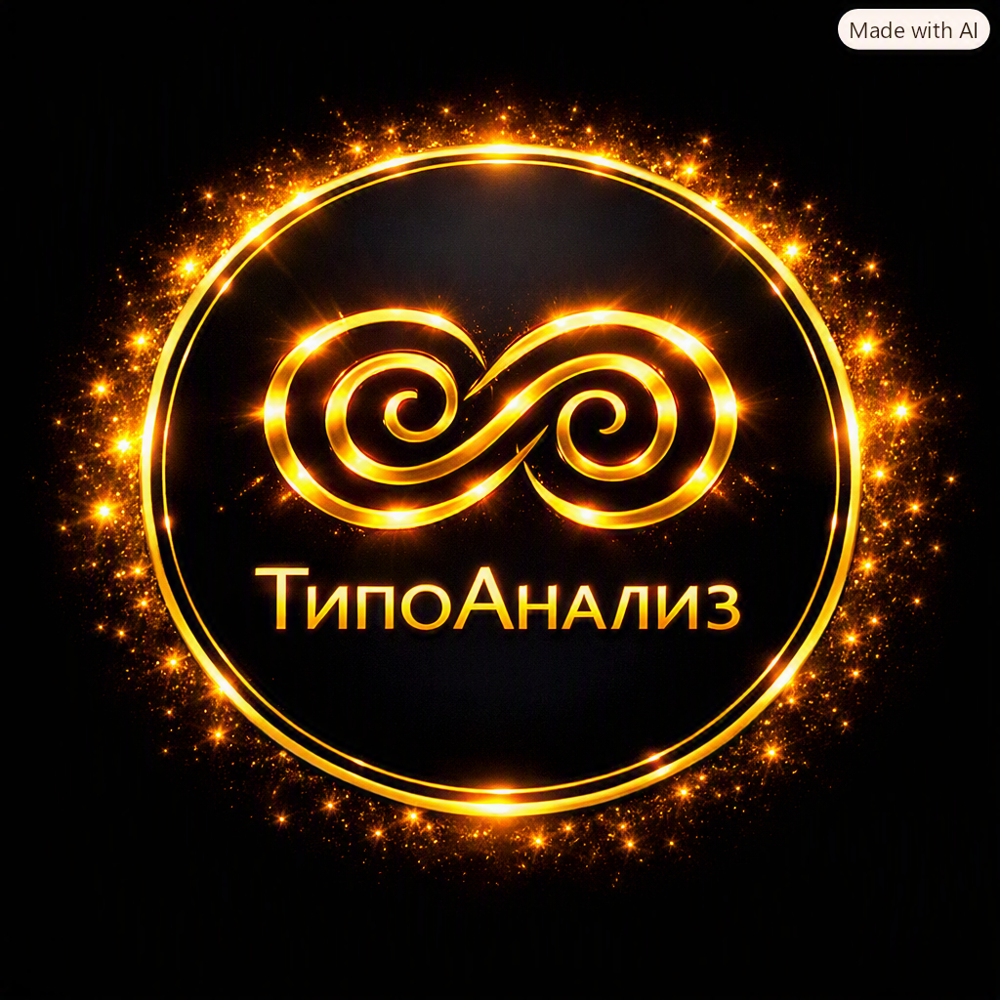

  

<h1 align="center">🌟 ТипоАнализ</h1>

Премиальная психологическая система понимания личности

---

## ✨ О проекте

ТипоАнализ — современный инструмент, который помогает человеку увидеть свой тип, реакции, темп общения, сильные стороны, чувствительные зоны и динамику отношений.  
Проект создан с акцентом на мягкость, премиальность и психологичность.

---

## 🧩 Структура приложения

### Взрослый анализ
1. Ваш тип  
2. Тип партнёра  
3. Совместимость  
4. Идеальный партнёр  
5. Как узнать его в жизни (5 экранов)  
6. Финал  

### Детский анализ
1. Тип ребёнка  
2. Сильные стороны  
3. Чувствительные зоны  
4. Как поддерживать  
5. Как не ранить  
6. Финал  

### Профиль пользователя
- результаты  
- история  
- настройки  

---

## 🗂 Главное меню

- Взрослый анализ  
- Детский анализ  
- Мой профиль  
- Настройки  
- О проекте  

---

## 🚀 Onboarding

1. Что такое ТипоАнализ  
2. Что даёт анализ  
3. Как проходит анализ  

---
## 🧭 Принципы дизайна

- Мягкость  
- Премиальность  
- Психологичность  
- Структурность  
- Спокойствие  
- Чистота  

---

## 📄 Лицензия

*(Добавьте свою лицензию, если требуется)*

---

## 💛 Автор

Проект создан с вниманием, теплом и уважением к пользователю.  
ТипоАнализ — спокойный, взрослый, премиальный психологический инструмент.
